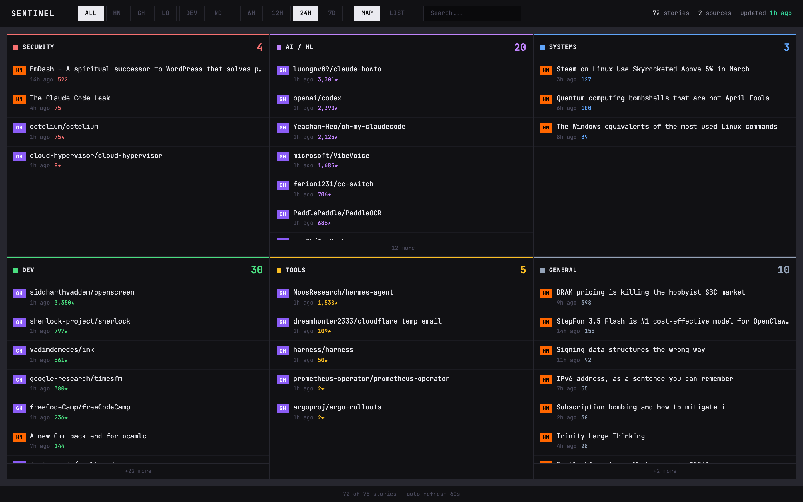
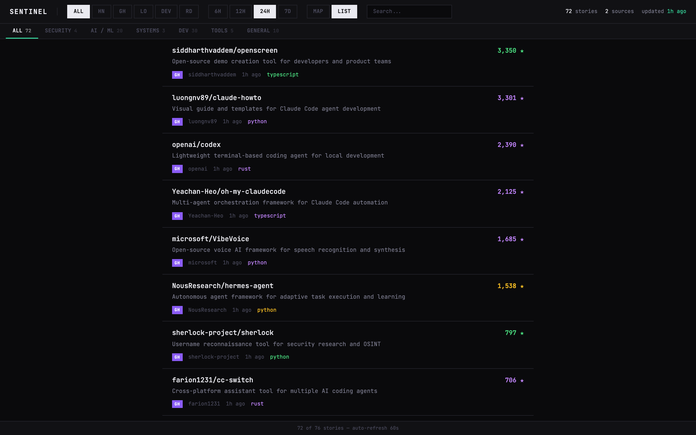
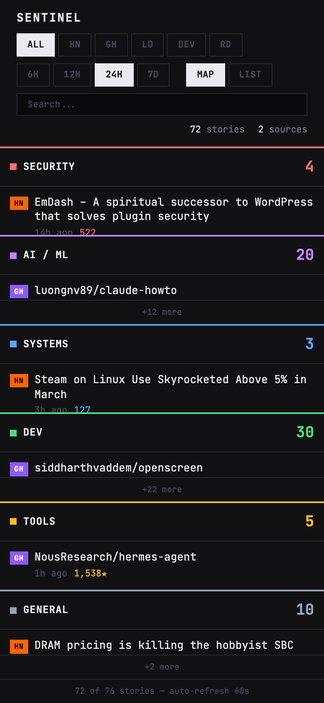

<div align="center">

<h1>Sentinel Feed</h1>

<p><strong>Open-source tech news aggregator for developers</strong></p>

<p>Pulls from 5 sources every 15 minutes, auto-categorizes by topic, ranks by community score, and optionally enriches with AI summaries.</p>

[](LICENSE)
[](https://www.typescriptlang.org)
[](https://nextjs.org)
[](https://sentinel-feed.pastelero.ph)
[](https://vercel.com/new/clone?repository-url=https%3A%2F%2Fgithub.com%2FCyvid7-Darus10%2Fsentinel-feed)

<br />



</div>

<br />

## Overview

Sentinel Feed replaces the daily ritual of cycling through Hacker News, GitHub Trending, Reddit, Lobsters, and Dev.to. It fetches, deduplicates, categorizes, and ranks stories from all five sources into a single dashboard — updated every 15 minutes.

Two view modes are available:

| Map View | List View |
|----------|-----------|
|  |  |
| Topic sectors at a glance — see what's hot in each category | Full-detail feed sorted by score — best for reading |

Stories are filtered by topic with a single click:


Mobile-responsive layout adapts automatically:

<p align="center">
  
</p>

## Sources

| Source | Data | Scoring |
|--------|------|---------|
| **Hacker News** | Top 30 stories via Firebase API | Upvotes |
| **GitHub Trending** | Trending repos in TypeScript, Python, Go, Rust | Stars gained today |
| **Lobsters** | Top 25 stories via JSON API | Upvotes |
| **Dev.to** | Top 30 articles of the day | Reactions |
| **Reddit** | r/programming, r/netsec, r/devops (15 each) | Upvotes |

All sources are free, require no API keys, and are fetched in parallel with independent error handling — one source failing doesn't block the others.

## Topic Categorization

Stories are automatically classified into six categories using keyword and tag matching:

| Topic | Color | What it catches |
|-------|-------|-----------------|
| **Security** | Red | CVEs, vulnerabilities, breaches, auth, privacy |
| **AI / ML** | Purple | LLMs, models, training, OpenAI, Anthropic |
| **Systems** | Blue | Compilers, kernels, databases, hardware |
| **Dev** | Green | Languages, frameworks, libraries, web |
| **Tools** | Yellow | DevOps, CI/CD, cloud, Docker, Kubernetes |
| **General** | Gray | Everything else |

## Tech Stack

| Layer | Technology |
|-------|------------|
| Framework | [Next.js 16](https://nextjs.org) (App Router, Server Components) |
| Language | TypeScript 5 |
| Styling | [Tailwind CSS 4](https://tailwindcss.com) + JetBrains Mono |
| Storage | [Vercel Blob](https://vercel.com/docs/storage/vercel-blob) (JSON, 7-day rolling window) |
| AI | [Vercel AI SDK](https://sdk.vercel.ai) + Claude Haiku (optional) |
| Scheduling | [Vercel Cron](https://vercel.com/docs/cron-jobs) (every 15 min) |
| Testing | [Vitest](https://vitest.dev) (59 tests, 97% coverage) |

## Getting Started

### Prerequisites

- **Node.js 18+**
- A [Vercel](https://vercel.com) account (free Hobby plan works)

### Installation

```bash
git clone https://github.com/Cyvid7-Darus10/sentinel-feed.git
cd sentinel-feed
npm install
```

### Environment Variables

Set in `.env.local` for local development, or in the Vercel dashboard for production:

| Variable | Required | Description |
|----------|----------|-------------|
| `BLOB_READ_WRITE_TOKEN` | Yes | Vercel Blob storage token |
| `CRON_SECRET` | Yes | Secret for authenticating cron job requests |
| `ANTHROPIC_API_KEY` | No | Enables AI-powered summaries and relevance filtering |
| `ENABLE_AI_ENRICHMENT` | No | Set to `false` to disable AI entirely (default: enabled) |

### Local Development

```bash
npm run dev
```

Trigger a manual fetch to populate data:

```bash
curl http://localhost:3000/api/fetch \
  -H "Authorization: Bearer YOUR_CRON_SECRET"
```

### Deployment

Push to GitHub with Vercel linked for automatic deploys, or deploy manually:

```bash
vercel --prod
```

### Running Costs

| Configuration | Estimated Monthly Cost |
|--------------|----------------------|
| Without AI | **$0** — Vercel Hobby free tier covers cron + blob storage |
| With AI (Claude Haiku) | **$3 – 5** — batch capped at 50 stories per cycle |

Set a spend limit under **Vercel > Settings > Billing > Spend Management** to avoid surprises.

## Project Structure

```
sentinel-feed/
├── src/
│   ├── app/
│   │   ├── page.tsx                # Dashboard entry (server component)
│   │   ├── layout.tsx              # Root layout, fonts, meta
│   │   ├── globals.css             # Theme tokens and component styles
│   │   └── api/
│   │       ├── fetch/route.ts      # Cron: fetch sources → AI enrich → store
│   │       ├── stories/route.ts    # GET /api/stories — filtered story list
│   │       ├── sources/route.ts    # GET /api/sources — source health status
│   │       └── cleanup/route.ts    # Cron: prune blobs older than 7 days
│   ├── components/
│   │   ├── tactical-map.tsx        # Main dashboard — filters, views, state
│   │   ├── sector-map.tsx          # Map view — topic sector grid
│   │   └── story-node.tsx          # Story card — title, score, meta
│   └── lib/
│       ├── fetchers/
│       │   ├── index.ts            # Parallel fetcher orchestration + dedup
│       │   ├── hackernews.ts       # Hacker News Firebase API
│       │   ├── github-trending.ts  # GitHub Trending HTML parser
│       │   ├── lobsters.ts         # Lobsters JSON API
│       │   ├── devto.ts            # Dev.to articles API
│       │   └── reddit.ts           # Reddit JSON API (3 subreddits)
│       ├── ai.ts                   # AI enrichment — summaries + filtering
│       ├── storage.ts              # Vercel Blob CRUD operations
│       ├── topics.ts               # Keyword-based topic classification
│       ├── types.ts                # Shared TypeScript interfaces
│       └── utils.ts                # Date formatting, URL normalization
├── vercel.json                     # Cron job schedules
└── vitest.config.ts                # Test runner configuration
```

## Adding a Source

Sentinel Feed is designed to make adding sources straightforward. Each source is a single file that returns `Story[]`.

1. Create `src/lib/fetchers/your-source.ts` — export an async function returning `Promise<Story[]>`
2. Add your source ID to the `SourceId` union in `src/lib/types.ts`
3. Register the fetcher in `src/lib/fetchers/index.ts`
4. Add the display name mapping in `src/app/api/fetch/route.ts`
5. Add to the valid sources set in `src/app/api/stories/route.ts`
6. Add filter button + badge styles in the UI components

See any existing fetcher (e.g., `lobsters.ts`) as a reference — most are under 60 lines.

## Testing

```bash
npm test              # Run all 59 tests
npm run test:watch    # Watch mode
npm run test:coverage # Coverage report (97%+)
```

## Contributing

Contributions are welcome. To get started:

1. Fork the repository
2. Create a feature branch (`git checkout -b feat/my-source`)
3. Write tests first, then implement
4. Verify all tests pass (`npm test`)
5. Open a pull request

## License

[Apache 2.0](LICENSE)
