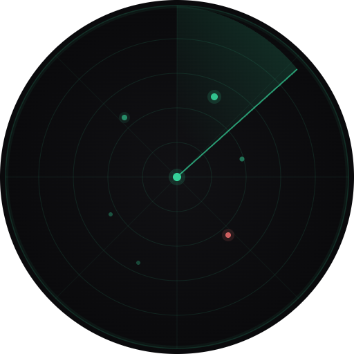
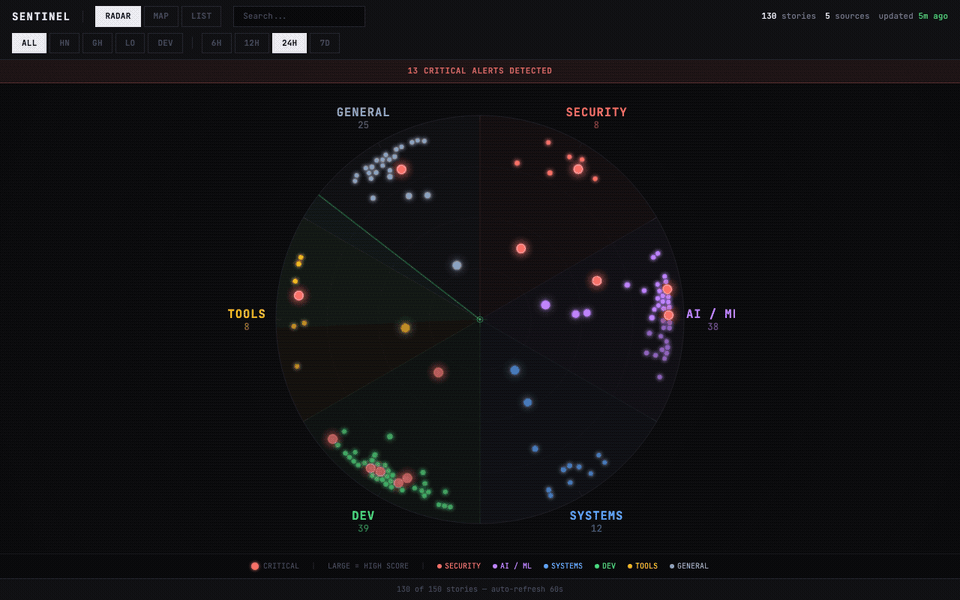
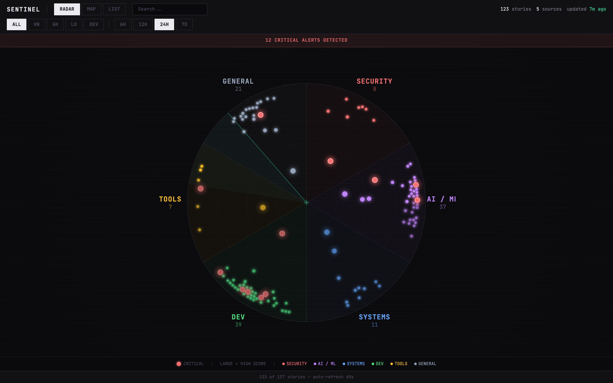
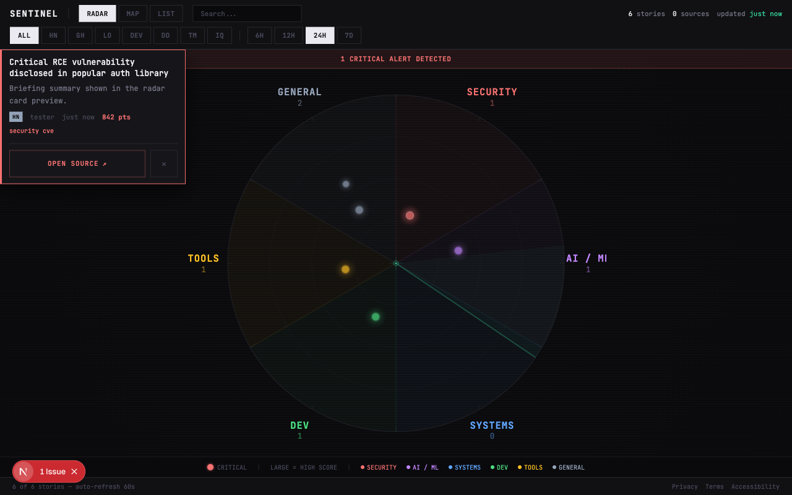
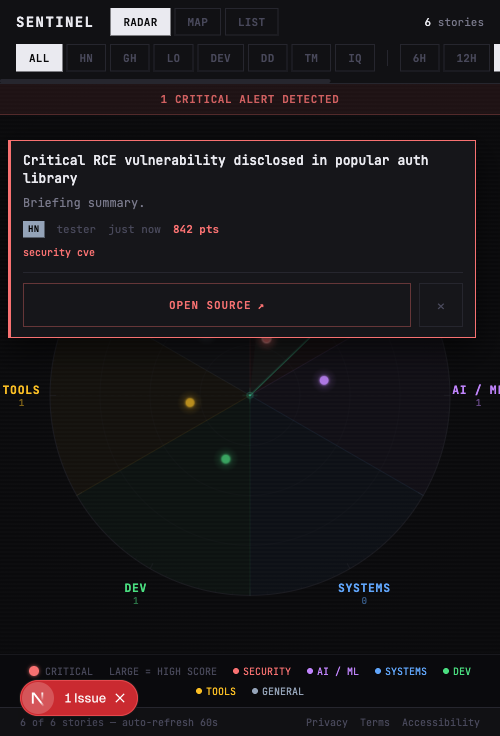
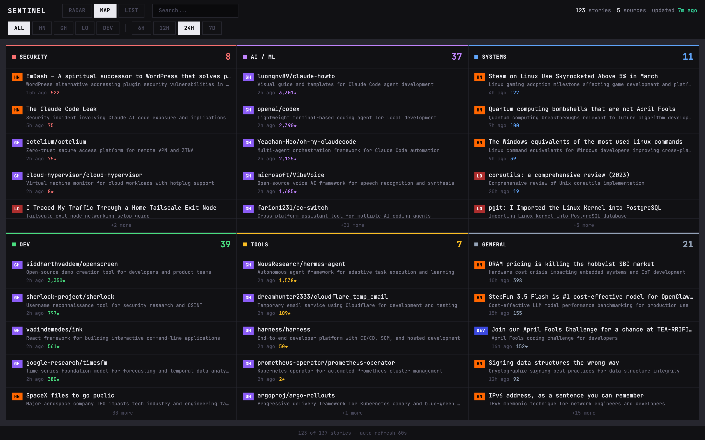
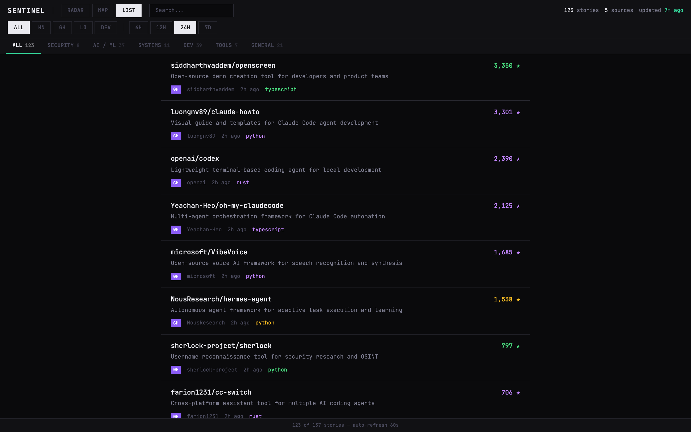
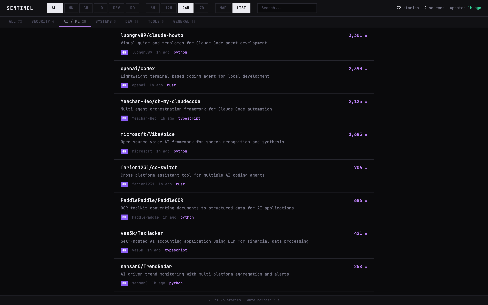
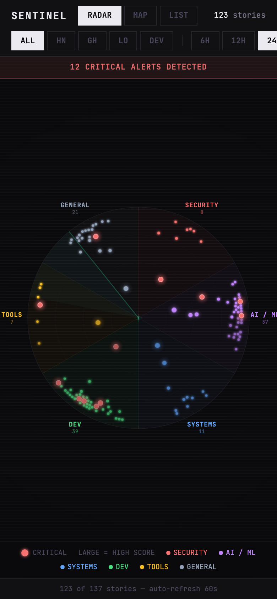
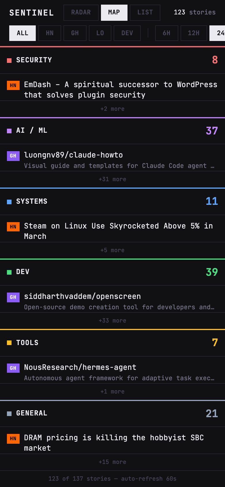

<div align="center">



<h1>Sentinel Feed</h1>

<p>Seven developer news sources on one screen, refreshed every 15 minutes.</p>

[](LICENSE)
[](https://www.typescriptlang.org)
[](https://nextjs.org)
[](https://sentinel-feed.pastelero.ph)
[](https://vercel.com/new/clone?repository-url=https%3A%2F%2Fgithub.com%2FCyvid7-Darus10%2Fsentinel-feed)

<br />



</div>

<br />

## What it does

Hacker News, GitHub Trending, Lobsters, Dev.to, daily.dev, Techmeme, InfoQ. Checking all seven every morning means seven tabs and a lot of the same links twice. Sentinel Feed pulls them on a 15-minute cron, drops duplicate URLs, sorts each story into a topic, ranks them against each other, and puts the result behind one dashboard.

There are three ways to read it:

- Radar plots every story as a dot inside a topic sector. Rank pulls the dot toward the center and makes it bigger. Security stories pulse red.
- Map shows all six sectors at once with the top stories in each.
- List is a plain ranked feed with topic tabs, for when you just want to skim titles.

Everything else is filtering: by source, by time window (6h, 12h, 24h, 7d), or by typing in the search box, which matches against titles, summaries, authors, and tags. Anything that looks like a CVE or a breach gets flagged separately so it does not get buried under trending repos. If an `ANTHROPIC_API_KEY` is set, Claude Haiku also gives each story a one-line summary, a topic, and an importance weight; without one, the app still runs, just on regex topics and raw scores.

## The views

### Radar

Dots are positioned by topic (angle) and rank (radius), so the interesting stuff clusters near the middle. Hovering a dot on desktop previews the story. Clicking pins a briefing card with an explicit "Open source" button, which keeps a stray tap from launching a link you did not mean to open.



<p align="center">
  
  &nbsp;&nbsp;
  
</p>

### Map

Six sectors in a grid, each listing its top stories with source badges, summaries, and scores. Hover for the full detail card, click a sector to drop into List view filtered to that topic.



### List

Sorted by rank. Each card carries the title, AI summary, source badge, author, relative time, tags, and the raw source score.



Topic tabs filter the feed. Here it is narrowed to AI/ML:



### On a phone

Radar labels scale down, map sectors stack, and the filter bars scroll sideways.

<p align="center">
  
  &nbsp;&nbsp;&nbsp;
  
</p>

## Sources

| Source | What we pull | Score means | Auth |
|--------|--------------|-------------|------|
| Hacker News | Top 30 stories, Firebase API | Upvotes | None |
| GitHub Trending | Trending repos in TypeScript, Python, Go, Rust | Stars gained today | None |
| Lobsters | Top 25 stories, JSON API | Upvotes | None |
| Dev.to | Top 30 articles of the day | Reactions | None |
| daily.dev | Top 25 most upvoted posts, GraphQL | Upvotes | None |
| Techmeme | Latest stories, RSS | n/a | None |
| InfoQ | Latest articles, RSS | n/a | None |

None of these need an API key. They are fetched in parallel through `Promise.allSettled`, and each fetcher catches its own errors, so a source going down costs you that source and nothing else. The failure shows up as an `error` status on `/api/sources`.

Duplicate links get dropped twice over: once against what is already stored, and once across sources within the same run, so a story that hits HN and Lobsters together only lands once.

## Ranking

Raw scores do not compare across sources. 400 upvotes on Hacker News and 40 reactions on Dev.to are both near the top of their own source, and Techmeme and InfoQ carry no score at all, so sorting on the raw number would pin every RSS story to the bottom permanently.

So ordering uses a rank blended half from the story's score percentile *within its own source* and half from an AI-assigned importance weight. Score-less sources compete on importance alone; if the AI is off, rank falls back to the percentile. The number printed on a card is still the raw source score, because "412 points" means something and "0.83" does not.

## Topics

Every story is sorted into one of six sectors. The AI picks the sector during enrichment; when it is off, unavailable, or returns something unrecognized, a keyword and tag regex takes over. First match wins, checked in this order:

| Sector | Color | Catches |
|--------|-------|---------|
| Security | Red | CVEs, vulnerabilities, breaches, auth, privacy, malware |
| AI / ML | Purple | LLMs, models, training, OpenAI, Anthropic, diffusion |
| Systems | Blue | Compilers, kernels, databases, hardware, quantum |
| Dev | Green | Languages, frameworks, libraries, frontend, backend |
| Tools | Yellow | DevOps, CI/CD, cloud, Docker, Kubernetes, infrastructure |
| General | Gray | Whatever is left |

## Critical alerts

Separate from topic sorting, every story's title, summary, and description are matched against a set of security patterns. This is plain regex, no model call, so it costs nothing and adds no latency.

| Category | Patterns |
|----------|----------|
| CVEs and advisories | CVE identifiers, security advisories and bulletins, Patch Tuesday |
| Vulnerabilities | Zero-days, exploits, actively exploited flaws |
| Attack vectors | SQL injection, XSS, SSRF, code/path/directory traversal, buffer and heap overflow, use-after-free, out-of-bounds |
| Access violations | Privilege escalation, auth bypass, session hijacking, credential stuffing and dumping, MITM |
| Malicious software | Malware, ransomware, trojans, rootkits, backdoors, botnets |
| Incidents | Data breaches, leaks, exfiltration, phishing, DDoS, supply chain compromises |
| Critical fixes | RCE, arbitrary code execution, critical patches and flaws |

A match makes the dot pulse red on the radar and trips the `CRITICAL ALERTS DETECTED` banner. In the menu bar app, those stories jump to the top of the list and fire a native notification.

## Stack

| Layer | What |
|-------|------|
| Framework | [Next.js 16](https://nextjs.org), App Router, Server Components |
| Language | TypeScript 5 |
| Styling | [Tailwind CSS 4](https://tailwindcss.com) with JetBrains Mono |
| Storage | [Vercel Blob](https://vercel.com/docs/storage/vercel-blob), one JSON blob per day, 7-day window |
| AI | [Vercel AI SDK](https://sdk.vercel.ai) with Claude Haiku, optional |
| Scheduling | [Vercel Cron](https://vercel.com/docs/cron-jobs), every 15 minutes |
| Charts | Hand-rolled SVG and CSS, no charting library |

## Running it locally

You need Node 20 or newer and a Vercel account. The Hobby plan is enough.

```bash
git clone https://github.com/Cyvid7-Darus10/sentinel-feed.git
cd sentinel-feed
npm install
cp .env.example .env.local
```

Fill in `.env.local` (or set these in the Vercel dashboard for production):

| Variable | Required | What it does |
|----------|----------|--------------|
| `BLOB_READ_WRITE_TOKEN` | Yes | Vercel Blob storage token |
| `CRON_SECRET` | Yes | Bearer token the cron routes check before doing anything |
| `ANTHROPIC_API_KEY` | No | Turns on AI summaries, topics, importance, and relevance filtering |
| `ENABLE_AI_ENRICHMENT` | No | Set to `false` to skip the model entirely. Defaults to on |

Then:

```bash
npm run dev
```

The dashboard will be empty until something has been fetched, so kick off a cycle by hand:

```bash
curl http://localhost:3000/api/fetch \
  -H "Authorization: Bearer YOUR_CRON_SECRET"
```

To deploy, push to a GitHub repo linked to Vercel, or run `vercel --prod`.

### What it costs to run

| Setup | Rough monthly |
|-------|---------------|
| No AI | $0. Cron and blob storage fit inside the Hobby free tier |
| With Claude Haiku | $3 to $5. Dedup runs before enrichment, so a steady cycle only pays for the 10 to 20 genuinely new stories |

Worth setting a cap under Vercel > Settings > Billing > Spend Management anyway.

## Layout

```
sentinel-feed/
├── src/
│   ├── app/
│   │   ├── page.tsx                # Dashboard entry (server component)
│   │   ├── layout.tsx              # Root layout, fonts, SEO metadata
│   │   ├── globals.css             # Theme tokens, radar animations, badges
│   │   ├── robots.ts               # robots.txt
│   │   ├── sitemap.ts              # sitemap.xml
│   │   ├── manifest.ts             # PWA manifest
│   │   ├── embed/                  # Compact view for the Sentinel Bar iframe
│   │   ├── privacy/                # Privacy policy
│   │   ├── terms/                  # Terms of service
│   │   ├── accessibility/          # Accessibility statement
│   │   └── api/
│   │       ├── fetch/route.ts      # Cron: fetch sources, enrich, store
│   │       ├── stories/route.ts    # GET /api/stories, filtered story list
│   │       ├── sources/route.ts    # GET /api/sources, per-source health
│   │       └── cleanup/route.ts    # Cron: drop blobs older than 7 days
│   ├── components/                 # atoms > molecules > organisms > templates
│   │   ├── atoms/                  # badge, filter-button, search-input, tab, topic-dot
│   │   ├── molecules/              # story-meta/node/tooltip, filter-group, promo-banner
│   │   ├── organisms/              # dashboard-toolbar, story-list-view, radar/sector/embed views
│   │   ├── templates/              # tactical-map, the dashboard composition root
│   │   └── hooks/                  # use-story-feed, polling plus feed state
│   ├── types/
│   │   └── react-css.d.ts          # CSS custom-property typing
│   └── lib/
│       ├── fetchers/
│       │   ├── index.ts            # Parallel orchestration, URL dedup
│       │   ├── hackernews.ts       # Firebase API
│       │   ├── github-trending.ts  # HTML scrape via cheerio
│       │   ├── lobsters.ts         # JSON API
│       │   ├── devto.ts            # Forem articles API
│       │   ├── dailydev.ts         # GraphQL API
│       │   ├── techmeme.ts         # RSS
│       │   ├── infoq.ts            # RSS
│       │   ├── rss.ts              # Shared RSS/Atom parser
│       │   └── create-story.ts     # Story builder with defaults
│       ├── ai.ts                   # Concurrent batched enrichment: relevance, summary, topic, importance
│       ├── classification.ts       # Critical-alert regex
│       ├── config.ts               # Constants that would otherwise be magic numbers
│       ├── cron-auth.ts            # CRON_SECRET bearer check
│       ├── radar-geometry.ts       # Radar layout math (pure, tested)
│       ├── ranking.ts              # Source-independent rank: score percentile blended with importance
│       ├── sources.ts              # Per-source names, badges, score units
│       ├── storage.ts              # Vercel Blob reads and writes
│       ├── time-range.ts           # Time-window type and helpers
│       ├── topics.ts               # Keyword-based topic sorting
│       ├── types.ts                # Shared interfaces
│       └── utils.ts                # Date formatting, URL normalization
├── docs/
│   ├── ARCHITECTURE.md             # How the fetch cycle, storage, and ranking fit together
│   ├── BRANDING.md                 # Design tokens, motion, copy register
│   ├── brand/                      # Logo source art
│   └── screenshots/                # README images
├── scripts/                        # Playwright screenshot and GIF capture
├── vercel.json                     # Cron schedules
└── vitest.config.ts
```

## Adding a source

A source is one file that returns `Story[]`. Most of them are under 60 lines, and `lobsters.ts` is the shortest one to copy.

1. Write `src/lib/fetchers/your-source.ts`, exporting an async function that returns `Promise<Story[]>`. Build rows with `createStory`, and pass `AbortSignal.timeout(FETCHER_TIMEOUT_MS)` to `fetch` so a hanging source cannot stall the cycle.
2. Add the ID to the `SourceId` union in `src/lib/types.ts`.
3. Register the fetcher in the `fetchers` array in `src/lib/fetchers/index.ts`.
4. Add a `SourceConfig` entry in `src/lib/sources.ts` with the display name, badge text, badge class, and score unit. That one entry feeds the filter buttons, the health panel, and `/api/stories?source=`.
5. Add the matching `.badge-xx` rule in `src/app/globals.css`.
6. Write tests in `src/lib/fetchers/__tests__/your-source.test.ts`.

## Sentinel Bar, the macOS menu bar app

[](https://apps.apple.com/app/sentinel-feed/id6761529644?mt=12)

Same feed, one click away from the menu bar. The icon carries a live count of critical alerts. Inside there is a SwiftUI list with a critical alerts section on top and the usual story cards, plus a tab that embeds the full radar in a WebView. It polls every 5 minutes and posts a native notification when a CVE shows up. Pure Swift, no Electron, under 5 MB.

[Get it on the Mac App Store.](https://apps.apple.com/app/sentinel-feed/id6761529644?mt=12)

## Contributing

Fork it, branch off `main`, write the test before the implementation, make sure `npm test` and `npm run build` both pass, then open a PR. Longer version in [CONTRIBUTING.md](CONTRIBUTING.md).

## License

[Apache 2.0](LICENSE)
